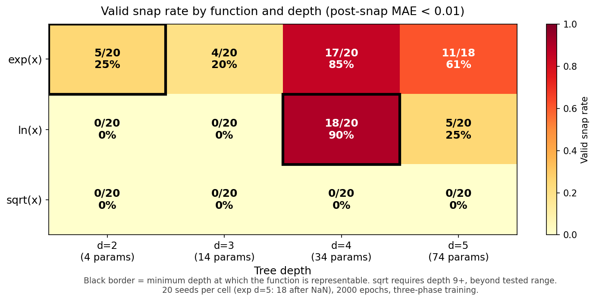

אִם יִרְצֶה הַשֵּׁם

# Valid and False Snapping in EML Expression Trees: The Basin Selection Problem

by **Daniyel Yaacov Bilar**, Chokmah LLC, chokmah-dyb@pm.me

v2.2 April 24 2026 (v2.1: SI warm-start subsection + Figure 2. v2.2: responds to review feedback: tones down novelty framing re Odrzywolek, removes unsupported gradient-escape mechanism claim, softens "solves completely" to tested-conditions, explains 0.000 variance)

ז׳ אִייָר ותשפ״ו

## Abstract

Training EML expression trees with gradient descent and then snapping soft input selectors to discrete choices should recover exact symbolic forms for elementary functions. Prior work reported commitment-based success criteria; we add a symbolic-correctness criterion and characterize the gap systematically. Three-phase training (Adam, entropy penalty, temperature annealing) drives every selector in every tree to a simplex vertex at every depth tested, so the commitment problem is solved. But vertex commitment does not guarantee correctness. We distinguish valid snaps (correct symbolic form, post-snap MAE below 1e-2) from false snaps (vertex selection but wrong form) across 240 training runs over three target functions and four tree depths. For ln(x), which requires depth 4 in a balanced binary tree, 18 of 20 seeds valid-snap to the exact form eml(1,eml(eml(1,x),1)). For exp(x) at its minimal depth 2, only 5 of 20 seeds find eml(x,1); the other 15 all collapse into a single competing basin, eml(x,x), with post-snap MAE 0.688. Extra depth correlates with higher valid-snap rate for exp (17 of 20 recover eml(x,1) at depth 4) but with lower valid-snap rate for ln at depth 5, which has more ways to misplace its three required gate levels. The mechanism behind the exp improvement is not established here. Valid snap rates peak at the function's representational depth for ln(x); for exp(x) they peak above it. The valid/false distinction, which prior work did not make, reveals basin selection rather than commitment as the bottleneck for symbolic recovery in EML trees.

## 1. Introduction

The EML operator eml(x, y) = exp(x) - ln(y) is functionally complete for elementary functions over the reals (Odrzywolek 2026). Any composition of exp, ln, and constants can be written as a tree of EML gates with inputs drawn from {1, x}. This makes EML trees a candidate architecture for symbolic regression: train a tree with gradient descent, then snap the soft input selections to hard choices, recovering a closed-form expression.

Odrzywolek demonstrated the approach for small trees and reported that snapping "works" without giving a systematic account of when it fails or what failure looks like. A single EML gate trained on exp(x) data recovers eml(x,1) = exp(x) - ln(1) = exp(x). His construction for ln(x) uses an unbalanced reverse-Polish tree of 6 gates that shares subtrees. In a balanced binary tree each leaf is independent, so the same expression requires 7 gates arranged over three gate levels, which we call depth 4.

We address two questions, one methodological and one empirical. The methodological question: does snapping produce the correct symbolic form, or merely any discrete form? Prior work reported whether selector weights reached simplex vertices but did not systematically separate that from whether the resulting expression matched the target. We introduce a validity criterion that combines vertex commitment with a post-snap loss check, and show it reveals a failure mode invisible to the commitment check. The empirical question: how does valid snap rate depend on tree depth relative to the function's representational depth?

Three-phase training with temperature annealing solves the commitment problem completely: every selector reaches a vertex at every depth tested. The remaining failure mode is basin selection. For exp(x) at depth 2, a dominant competing basin eml(x,x) captures 75% of seeds. For ln(x), valid snap rate peaks at its representational depth (depth 4). Extra depth helps exp by giving the optimizer alternative routes around competing basins but hurts ln by multiplying the configurations that fail to place the three required gate levels correctly.

## 2. Method

### 2.1 Architecture

We use balanced binary EML trees. A tree of depth d has d-1 gate levels. Each gate computes eml(x, y), where x and y are each selected by an independent InputSelector module.

Bottom-level selectors (level 0, directly above the tree inputs) choose from {1, x} using a 2-way softmax over learnable logits. Upper-level selectors choose from {1, x, f} where f is the output of a child gate, using a 3-way softmax. The total parameter count is 5 * 2^(d-1) - 6, matching Odrzywolek's formula.

| Depth | Gate levels (d-1) | Selectors | Parameters |
| ----- | ----------------- | --------- | ---------- |
| 2     | 1                 | 2         | 4          |
| 3     | 2                 | 6         | 14         |
| 4     | 3                 | 14        | 34         |
| 5     | 4                 | 30        | 74         |

The EML gate clamps its first input to [-8, 8] before exponentiation and takes the real part of the complex-valued computation, which gives a smooth extension for negative arguments to ln.

### 2.2 Depth conventions and target forms

Our depth (levels + 1) differs from Odrzywolek's level count by one. His "level n" is our depth n+1. More importantly, his RPN construction for ln(x) shares the subtree eml(1,x) between two places in the tree, which saves one gate level. A balanced binary tree cannot share leaves, so the same expression requires one additional level. Specifically:

- **exp(x) = eml(x,1).** One gate, two 2-way selectors. Minimal depth: 2.
- **ln(x) = eml(1, eml(eml(1,x), 1)).** Three gates arranged as (bottom: one gate eml(1,x); middle: one gate taking that as input; top: one gate taking the middle as input). Our balanced binary tree places these as 2 + 1 + 1 gates across levels 0, 1, 2, which is depth 4 with 7 total gates. Odrzywolek's unbalanced tree writes the same expression in 6 gates at level 3 by sharing the eml(1,x) subtree.
- **sqrt(x).** Odrzywolek shows the minimal EML expression for sqrt(x) requires at least 35 gates and correspondingly a depth of 9 or more. We include sqrt as a negative control; no depth we test can represent it.

### 2.3 Target functions

- exp(x) on [-2, 2], 128 samples
- ln(x) on [0.1, 10], 128 samples
- sqrt(x) on [0.1, 10], 128 samples

### 2.4 Training protocol

Three phases over 2000 epochs per run:

**Phase 1 (epochs 1-1200, 60%).** Standard Adam on MAE loss. No regularization. Selectors remain soft.

**Phase 2 (epochs 1201-1600, 20%).** Adam continues. An entropy penalty is added: the sum over all selectors of the Shannon entropy of their softmax weights, with coefficient ramping linearly from 0 to 0.05. This pushes selectors toward vertices by penalizing diffuse distributions.

**Phase 3 (epochs 1601-2000, 20%).** Entropy penalty at full strength. Softmax temperature anneals from 1.0 to 0.05, sharpening all selectors toward hard selections.

Learning rates: 0.01 for depth 2, 0.001 for depths 3-4, 0.0005 for depth 5. Gradient clipping at max norm 10. Selector logits initialized from N(0, 0.1). 20 seeds per (function, depth) cell, with deterministic seeding. Two exp d=5 runs (seeds 0 and 2) diverged to NaN during training; we report results on the remaining 238.

### 2.5 Snap criterion

After training, all selectors are snapped to their argmax vertex. The snapped tree computes a deterministic closed-form function of x, which we evaluate on the same 128-point grid used for training and compare to the target. We call this the **post-snap loss** (post_snap_loss in the released data).

- **Snapped:** all selectors have max softmax weight >= 0.9. This holds for every run we generated.
- **Valid snap:** snapped AND post_snap_loss < 0.01.
- **False snap:** snapped AND post_snap_loss >= 0.01.

The distinction between valid and false snaps is the central methodological contribution. Prior work reported only the commitment criterion. A separate quantity, the **pre-snap loss** (stored as final_loss in the released CSV, equal to the best task loss during training before vertex collapse completes), can be much smaller than the post-snap loss in deep trees because the continuous relaxation can interpolate between vertex configurations in ways no single snapped tree can match. Reporting pre-snap loss as a proxy for correctness, as an earlier version of this analysis did, understates the basin selection problem. The released CSV contains both quantities.

## 3. Results

240 EML trees (3 functions x 4 depths x 20 seeds), 2000 epochs each. Two runs (exp d=5 seeds 0 and 2) diverged to NaN; 238 completed.

### 3.1 Universal vertex commitment

Mean max-weight across selectors (our "snappability" metric) is 1.000 for every run, minimum 1.000 to four decimals. Every selector in every trained tree sits at a simplex vertex after annealing. The commitment problem is solved: every run yields a discrete symbolic expression.

### 3.2 Valid snap rates

**Table 1. Valid snap counts (out of 20 seeds, except exp d=5 with 18 non-NaN).**

|         | d=2  | d=3  | d=4  | d=5  | Min depth to represent |
| ------- | ---- | ---- | ---- | ---- | ---------------------- |
| exp(x)  | 5    | 4    | 17   | 11   | 2                      |
| ln(x)   | 0    | 0    | 18   | 5    | 4                      |
| sqrt(x) | 0    | 0    | 0    | 0    | 9+                     |

Three patterns:

**ln(x) peaks at representational depth.** 18 of 20 seeds at d=4 recover the exact form eml(1,eml(eml(1,x),1)) with post_snap_loss = 0 to numerical precision (mean 3e-8). At d=2 and d=3 the tree cannot express ln(x) at all; valid snap rate is 0/20 as expected. At d=5, valid snap rate drops to 5/20: the tree can still express ln(x), but there are more ways to misplace the three required gate levels.

**exp(x) improves with depth.** The minimal depth (2) is the worst performer, not the best. At d=2 the recovery rate is 5/20 because a single competing basin, eml(x,x), traps 75% of seeds (see Section 3.3). Deeper trees give the optimizer escape routes: at d=4 the recovery rate is 17/20 and all valid snaps take the form eml(x,1) with unused subtrees collapsing to constants. At d=5, recovery rate is 11/18 (61%), still well above d=2. Figure 1 visualizes these rates as a heatmap; the representational-depth cell for each function is marked.

**sqrt(x) is a falsification check.** No depth we test can represent sqrt, and no run produces a valid snap. This confirms the criterion does not simply track "did training converge?" The continuous optimizer finds reasonable fits (pre-snap MAE 0.078 at d=4) but no vertex configuration matches sqrt, so snapping destroys the fit every time.

### 3.3 False snaps cluster in identifiable basins

False snaps are not random. They concentrate in a small number of competing forms whose structure is interpretable.

**exp d=2** (5 valid / 15 false). All 15 false snaps land on eml(x,x) = exp(x) - ln(x), with post_snap_loss 0.688 (std 0.000 to 4 decimals). The zero variance reflects identical symbolic forms across seeds: once snapping commits every selector to the same vertices, the resulting function is deterministic and its evaluation is identical across runs. The depth-2 tree has exactly 4 possible snapped forms. Only one (eml(x,1)) is correct; one other (eml(x,x)) is a genuine approximation of exp(x) on [-2, 2] and captures 75% of seeds. At this depth, the fraction of seeds captured by the eml(x,x) form (15/20) exceeds the fraction captured by any other non-target form, which explains why extra configuration count at higher depths is compatible with improved recovery.

**exp d=3** (4 valid / 16 false). The eml(x,x) basin still dominates (10 of 16 false snaps, 50% of all runs). The remaining 6 false snaps spread across four other forms (eml(x,eml(1,1)), eml(1,eml(1,1)), eml(1,eml(1,x)) and similar) with post_snap_loss 1.0 to 1.5. The competing basin has not yet been escaped.

**exp d=4** (17 valid / 3 false). All three false snaps take the shape eml(x, eml(1, eml(..., ...))), where the outer structure is correct but a deeper subtree has an extra non-trivial gate that should have collapsed to a constant. Post_snap_loss 0.78 to 0.91. The eml(x,x) basin has been fully escaped.

**ln d=2** (0 valid / 20 false). All 20 land on eml(1,x) = e - ln(x), the best depth-2 approximation. No seed finds a valid form because ln(x) cannot be expressed at depth 2.

**ln d=4** (18 valid / 2 false). Both false snaps land on eml(1,eml(eml(1,1),x)), a near-miss that swaps x and 1 in one gate. Post_snap_loss 1.387.

**ln d=5** (5 valid / 15 false). Three forms cover all false snaps: eml(1,eml(eml(1,x),x)) (7 seeds), eml(1,eml(1,x)) (6 seeds), eml(1,eml(1,1)) (2 seeds). The correct form still appears, but now competes with two structurally similar wrong forms that differ by a single selector choice.

### 3.4 Subtree collapse at over-deep trees

Every valid snap for exp(x) at every depth recovers exactly eml(x,1). At d=3, d=4, d=5 the tree achieves this by routing x through one path and setting the remaining selectors to constants, so the extra gates compute fixed values that do not affect the output. This is not a failure mode; it is the architecture working as intended, using capacity it does not need. The co-occurrence of this subtree-collapse pattern with improved valid-snap rates at d=4 is consistent with multiple mechanisms (more parameters to fit during phase 1, alternative gradient paths, or simply a larger basin of attraction for the correct form); distinguishing between these would require ablation experiments not conducted here.

ln(x) does not show the same benefit from extra depth. Its valid form requires three specific gate levels and the fourth level at d=5 only adds room for wrong choices.

## 4. Discussion

### Commitment vs basin selection

The three-phase protocol decouples two problems. Temperature annealing solves commitment: every selector reaches a vertex. It does not solve basin selection: the loss surface has multiple vertex attractors and training does not reliably find the correct one. This explains why earlier small-scale results reported snapping as "working". At depth 2 the vertex geometry is simple enough that the correct basin sometimes wins, but at no depth we tested does the protocol guarantee correctness.

### Why false snaps cluster

Competing forms are not arbitrary. eml(x,x) = exp(x) - ln(x) is a genuine local minimum on the exp training surface, with MAE 0.688 on [-2, 2] compared to MAE 0 for eml(x,1). During phase 1 the continuous optimizer may descend into its basin. Phases 2 and 3 then commit to whatever vertex is nearest, without basin-jumping. The critical phase for correctness is phase 1. Methods that improve basin selection during phase 1 (better initialization, curriculum training, warm-starting from solved subtrees) may improve valid snap rates without changing the annealing protocol.

### Connection to Odrzywolek's warm-start evidence

The Supplementary Information released with Odrzywolek (2026) provides independent support for the basin-selection framing. His Table S7 reports that trees initialized from the known correct expression plus Gaussian logit noise (sigma = 12) recover the target at 100% for depth 5 and depth 6 (4 of 4 runs at each depth, snapped MSE near 1e-32). In his own words, "the correct solutions are stable attractors. The practical barrier at depths >= 5 is not the representation itself but the exponentially growing number of local minima that trap random initializations." That is the same conclusion we reach from the blind-initialization side. Commitment is not the bottleneck. Basin selection is.

A direct rate comparison is informative but requires care because the target functions differ. Odrzywolek trains against nested EML self-compositions of depth d (his Table S4), so representational depth and tree depth grow together; we train against fixed targets (exp, ln) with representational depths 2 and 4, so the ratio of tree depth to representational depth varies across our grid.

| Source                                                     | d=2  | d=3   | d=4   | d=5   |
| ---------------------------------------------------------- | ---- | ----- | ----- | ----- |
| Odrzywolek Table S5, blind runs, target depth = tree depth | 100% | 26.6% | 23.4% | 0.89% |
| This work, blind runs, exp(x), representational depth 2    | 25%  | 20%   | 85%   | 61%   |
| This work, blind runs, ln(x), representational depth 4     | 0%   | 0%    | 90%   | 25%   |

The patterns are consistent once representational depth is controlled. When the tree exactly matches the target's representational depth (Odrzywolek at every row; our ln at d=4) recovery is high. When the tree is over-depth, the consequence depends on basin geometry: for our exp(x) the extra gates help by routing around the eml(x,x) competitor (d=4 peak at 85%); for Odrzywolek's self-composition targets at d>=5 the combinatorial count of incorrect forms dominates and recovery collapses.

A separate concern the Odrzywolek SI raises is numerical impostors: expressions that agree with the target to within one unit in the last place at IEEE 754 double precision but fail at 64-digit or higher precision (SI Sect. 1.2). His reported impostor example, eml(eml(eml(1,eml(0,eml(A,gamma))),eml(gamma,A)),eml(1,1)), evaluates to about -0.9999999999999998. Our validity criterion is post-snap MAE < 0.01 in double precision, and our false snaps all sit at post-snap MAE >= 0.688. The gap between our threshold and our competing basins is about fourteen orders of magnitude wide, so impostors cannot pass our filter with the current target set. If future work tightens the threshold (toward exact symbolic recovery) or extends to targets whose competing basins are numerically closer, a 128-digit mpmath re-check in the style of SI Sect. 2.2 should be added as a post-processing pass. The risk is not present for (exp, ln, sqrt) at MAE=0.01.

### Depth effects differ per function

Pure configuration counting predicts deeper trees should be worse for all functions: at d=2, d=3, d=4, d=5 the number of snapped forms is 4, 144, 186,624, and roughly 3.1 x 10^11 respectively. ln follows this pattern (peak at d=4, drop at d=5). exp does not: recovery climbs sharply from d=2 (5/20) and d=3 (4/20) to d=4 (17/20), then drops back to d=5 (11/18). The difference from ln lies in basin geometry at the minimal depth. For ln at d=4, the continuous loss surface makes the correct basin large and few competitors are close, so the optimizer routinely finds it. For exp at d=2 and d=3, the competing basin eml(x,x) dominates (15/20 at d=2, 10/20 at d=3 despite the larger configuration space). Only at d=4 does the tree have enough free structure to escape that basin. The d=5 drop-off matches ln's: extra depth past the escape point starts costing valid snaps again.

This suggests that for functions with dominant low-depth competitors, using a deeper tree than representation theory requires is actively beneficial. For functions where the representational depth already has a favorable basin structure, extra depth hurts.

### Limitations

One optimizer (Adam), one loss (MAE), one architecture variant (balanced binary tree), three target functions. The three-phase schedule was not tuned; different entropy coefficients or annealing rates may shift rates. 20 seeds per cell is enough for the strong effects we report (ln d=4 at 90%, exp d=4 at 85%, exp d=2 basin capture at 75%) but not to precisely estimate rates near the extremes. Computation on CPU.

## 5. Conclusion

Temperature annealing in EML expression trees solves the commitment problem across all tested conditions: every selector reaches a simplex vertex at every depth we tested. It does not solve the basin selection problem. Using post-snap loss as the validity criterion (rather than vertex commitment or pre-snap loss) reveals the actual recovery pattern: ln(x) peaks at its representational depth (18/20 at d=4), exp(x) improves with over-depth (5/20 at d=2 to 17/20 at d=4) because extra gates provide escape routes from a dominant competing basin, and sqrt(x) fails everywhere, as predicted. The valid/false distinction, together with per-cell basin composition, is the minimum reporting needed to characterize symbolic recovery in EML trees. Snappability alone hides the dominant failure mode.

## Data and code

All code (`eml_layer_v2.py`, `experiment_v2.py`) and the full 240-run results CSV (`snapping_v2_final.csv`, including final_loss, post_snap_loss, and symbolic_form for every run) are released with this note.

## References

Odrzywolek, A. (2026). [All elementary functions from a single binary operator](https://arxiv.org/pdf/2603.21852) arXiv:2603.21852v2. Main text and Supplementary Information.

Cited from main text for: the EML operator eml(x,y) = exp(x) - ln(y); functional completeness over elementary functions on the reals; the parameter count 5 * 2^(d-1) - 6 for balanced binary EML trees; exp(x) = eml(x,1) at minimum depth; the representation of ln(x) via an unbalanced 6-gate RPN tree; the 35+ gate lower bound for sqrt(x).

Cited from Supplementary Information for: the three-phase Gumbel-Softmax training pipeline (SI Sect. 3.3); the blind-recovery rates across depths 2 to 6 (SI Table S5); the warm-start recovery at 100% for depths 5 and 6 confirming correct solutions are stable attractors (SI Sect. 3.7, Table S7); the quote on local minima as the practical barrier (SI Sect. 3.9); the numerical-impostor example and the 128-digit mpmath safeguard (SI Sect. 1.2, 2.2).