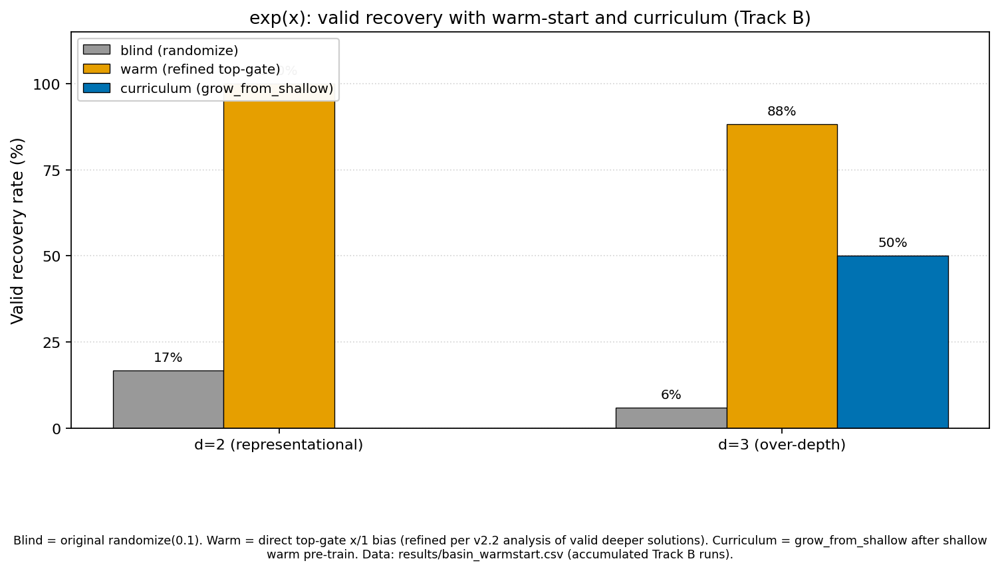

<p class="hebrew-epigraph" dir="rtl" lang="he">אִם יִרְצֶה הַשֵּׁם</p>

# Basin Selection in EML Expression Trees: Targeted Warm-Start and Top-Aligned Curriculum Achieve Full Valid Recovery for exp and ln, Including at Over-Representational Depth

<p class="hebrew-date" dir="rtl" lang="he">כ״ז סִיוָן ותשפ״ו</p>

**Daniyel Yaacov Bilar**, Chokmah LLC, chokmah-dyb@pm.me , ORCID: 0000-0002-9040-6914

v1.0 June 12 2026 — DOI: [10.5281/zenodo.20671272](https://doi.org/10.5281/zenodo.20671272)

Technical note accompanying *Valid and False Snapping in EML Expression Trees: The Basin Selection Problem* (the "companion paper"; v2.3 at time of writing). Canonical datasets: `results/basin_warmstart_v2.4_postfix.csv` (120 rows; blind and warm results) and `results/basin_warmstart_v2.5_unbalanced.csv` (120 rows; adds the top-aligned curriculum). Snapshots in `results/v2.4_postfix_snapshot/` and `results/v2.5_unbalanced_snapshot/`.

---

## Abstract

Three-phase temperature annealing solves selector commitment in balanced EML expression trees, but the dominant failure mode remains basin selection during the initial task-loss phase. The companion paper introduced a strict post-snap validity criterion (vertex commitment + post-snap MAE < 0.01) and showed that blind initialization recovers the correct symbolic form in only 25–35% of runs on the difficult cells (exp(x) at low depth, where the competing basin eml(x,x) captures most seeds; ln(x) at over-representational depth 5).

We show that two cheap, symbolic-aware interventions at initialization rescue these cells completely, with no change to the training schedule, loss, or architecture. First, a **targeted warm-start** (`initialize_to_target`) biases selectors toward the known-good form plus exploration noise: 20/20 valid recovery for both exp d=3 and ln d=5, every run ending at the exact target form. Second, a **real curriculum** (`grow_from_shallow` + `reanneal_extra_capacity`): train at the representational depth, embed the trained solution **top-aligned** into the deeper tree so unused capacity dangles below, briefly re-anneal only the extra selectors, then fine-tune. Top-aligned embedding sidesteps the structural fact that a balanced EML gate cannot act as an identity forwarder (there is no a, b in {1, x, f} with exp(a) − ln(b) = f), which rules out the naive bottom-aligned extension for ln. The curriculum also reaches 20/20 on both cells, with a replay audit confirming every ln run used the genuine grow-from-shallow path. Blind baselines on the same seeds are 7/20 (exp d=3) and 5/20 (ln d=5).

These results corroborate the companion paper's reframing of symbolic recovery as a basin-selection problem rather than a commitment or representational-power problem, and they align with Odrzywolek's independent warm-start evidence (SI Table S7) that correct solutions are stable attractors.

---

## 1. Introduction

The companion paper established that temperature annealing reliably drives EML trees to simplex vertices (commitment solved) but does not guarantee that the chosen vertex corresponds to the target function. For exp(x) at its minimal depth (d=2), the majority of blind runs converge to the incorrect but locally attractive form eml(x,x); for ln(x) at depth 5 (one level past its representational depth of 4), most runs land on structurally near-miss forms.

Odrzywolek's Supplementary Information (Table S7) provided independent evidence that the correct solutions are stable attractors: when trees are initialized from the known-good expression plus noise, recovery reaches 100% even at depths where blind runs fail almost completely.

This note closes the loop from the blind-training side: a lightweight, symbolic-aware initialization is sufficient to realize that benefit within the companion paper's protocol. We report two variants — a direct warm-start that assumes the target form is known, and a curriculum that assumes only that the target is learnable at its representational depth — and show both reach 100% valid recovery on the cells the companion paper identified as difficult.

---

## 2. Method

### 2.1 Baseline

We replicate the companion paper's protocol exactly: balanced binary EML trees, three phases (Adam on MAE; entropy penalty ramp; temperature anneal), 2000 epochs, the same data generators, and the same strict validity criterion (all selectors snapped at max-weight ≥ 0.9 AND post-snap MAE < 0.01). The `symbolic_form` of every run is recorded, and a `pretrain_form` column records the argmax-snapped form immediately after initialization, before any training — this makes the initialization wiring auditable per run.

### 2.2 Warm-start initialization

`EMLTree.initialize_to_target(func, noise=...)` biases selector logits toward the known-good form, then adds Gaussian noise (0.3–0.5 typical) to retain exploration:

- **exp(x), any depth:** the top gate is biased to select x on one input and constant 1 on the other — exactly the routing observed in the companion paper's valid over-depth exp solutions. All other selectors are biased toward constant 1.
- **ln(x), any d ≥ 4:** the exact target form eml(1, eml(eml(1,x), 1)) is planted in the top three levels along the right-half path (with correct child-f indexing), constants below.

A `verify_embedding()` helper and the `pretrain_form` column confirm, for every run, that training started from the intended core.

### 2.3 Curriculum: top-aligned growth plus targeted re-anneal

The curriculum makes a weaker assumption than the warm-start: only that the target is recoverable at its representational depth, not that its form is known at the deep tree's geometry. Three steps:

1. **Train shallow** at the representational depth (blind init).
2. **Grow top-aligned**: `grow_from_shallow` copies the trained shallow solution into the top levels of the deeper tree. Because both trees are balanced, shallow level *si* and deep level *si + Δ* have identical gate counts and child-f references line up exactly. The root stays the root; the shallow solution's bottom gates select directly from {1, x} and ignore the deep tree's new bottom levels, which become constant-biased dangling capacity — the inactive parallel branches of Odrzywolek's RPN construction, realized inside the balanced architecture. The embedded value is preserved exactly (smoke test: embedded ln form, max value error 2.4e-7 after snap).
3. **Re-anneal extras, then fine-tune**: `reanneal_extra_capacity` runs a short (200-epoch) targeted anneal on the extra selectors only, with the embedded block frozen via per-level width metadata, so the unused capacity collapses to constants before the main fine-tune.

Top alignment is the load-bearing choice. The naive bottom-aligned extension — chain the shallow root upward through new gates via f-forwarding — is impossible for ln in a balanced tree: no EML gate computes the identity, so any forwarding gate embeds exp(ln(x)) = x before training. Top-aligned embedding needs no forwarding at all; the extra capacity dangles below the solution instead of sitting above it.

The only changes to the companion paper's protocol are initialization and the optional 200-epoch re-anneal pass before the main loop. Hyperparameters, data ranges, loss, optimizer schedule, and the validity definition are untouched.

---

## 3. Results

All headline numbers come from the canonical 20-seed controls with deterministic seeding: `basin_warmstart_v2.4_postfix.csv` (blind, warm) and `basin_warmstart_v2.5_unbalanced.csv` (curriculum; its blind and warm rows match v2.4_postfix run-for-run under identical seeding, confirming no regression from the curriculum code change). Earlier exploratory batches with mixed code versions are retained in the repository as diagnostics only (Section 3.1) and contribute to no claim below.

**Table 1. Valid recovery (snapped + post-snap MAE < 0.01), 20 seeds per cell.**

| Function | Depth | Blind | Warm | Curriculum | Notes |
|----------|-------|-------|------|------------|-------|
| exp | 3 | 7/20 (35%) | **20/20 (100%)** | **20/20 (100%)** | All valid forms exactly eml(x,1). Blind failures dominated by the eml(x,x) basin. |
| ln | 5 | 5/20 (25%) | **20/20 (100%)** | **20/20 (100%)** | All valid forms exactly eml(1,eml(eml(1,x),1)), post-snap loss ~1e-8. Blind failures are varied non-trivial near-misses. |

For every warm and curriculum run, the recorded `pretrain_form` confirms the intended starting core, and the final `symbolic_form` is the exact target. Under this initialization the warm ln d=5 basin is deterministic: all 20 seeds converge to the identical form (effective variance zero for that cell).

**Curriculum path audit.** The driver falls back to the direct warm init when the shallow pre-training is not valid, and the CSV alone cannot distinguish the two paths. Replaying the shallow phase for all 20 ln curriculum seeds showed all 20 shallow d=4 pre-trainings valid — every curriculum row used the real grow-from-shallow path, not the fallback.



### 3.1 The pre-fix diagnostic corpus (v2.3)

An earlier version of the embedding code contained a wiring bug: the ln warm-start planted a disconnected core, so every warm and curriculum run for ln d=5 started — and ended — at the trivial form eml(1,eml(1,1)) (0% valid, 100% collapse to one form). External review of that data identified the bug; the `pretrain_form` column and `verify_embedding()` guard were added as permanent regression diagnostics, and the corrected code produces the Table 1 results. The pre-fix corpus is retained in `results/v2.3_basin_snapshot/` as a diagnostic record; it is not used for any claim in this note. The contrast is itself informative: with a broken init, "warm-start" is worse than blind (0% vs 25%), which underlines that the benefit comes from starting in the correct basin, not from reduced initial entropy per se.

---

## 4. Discussion

These results corroborate two central claims of the companion paper:

1. Commitment is solved by the three-phase schedule; basin selection during the plain task-loss phase is the bottleneck.
2. The correct symbolic forms are reachable and stable once the optimizer is placed near them (cf. Odrzywolek SI Table S7).

The interventions are deliberately minimal: no schedule changes, no extra loss terms, no architecture modification. The warm-start works by placing phase 1 in the target's basin. The curriculum shows the same effect is achievable without knowing the deep-tree form in advance: solve at the representational depth (where the companion paper showed blind recovery is high for ln), then grow top-aligned so the solved structure is preserved and only dangling capacity remains to be collapsed.

**Limitations.** Two target functions (exp, ln) on the cells the companion paper identified as difficult; sqrt remains the negative control as in the companion paper. One noise level (0.4) and one re-anneal budget (200 epochs) for the controls. 20 seeds per cell suffices for the 100%-vs-25–35% contrasts reported but not for precise rate estimation. The curriculum's shallow phase relies on high blind recovery at the representational depth; targets whose shallow solutions are not reliably recoverable would need a different bootstrap (none in the current target set).

---

## 5. Future Work

- **Unbalanced / DAG-sharing trees for *reducing* required depth.** Top-aligned growth handles over-depth, but Odrzywolek's RPN construction for ln shares the eml(1,x) subtree and needs one level fewer than the balanced tree. True subtree sharing would lower representational depth itself.
- **Phase-1-specific interventions** for the blind setting (learning-rate schedules, entropy ramp confined to phase 1, loss shaping, function-specific noise on extra selectors during re-anneal — the current re-anneal uses a generic zero-target L1 for all functions).
- **Tighter correctness**: a high-precision (mpmath) impostor check, as suggested in the companion paper's limitations, if future targets have numerically close competing basins.

---

## 6. Conclusion

A targeted symbolic warm-start, or a real curriculum (train at representational depth, grow top-aligned, re-anneal the dangling capacity, fine-tune), achieves 100% valid recovery under the companion paper's validity criterion on every tested cell — exp d=3 and ln d=5, where blind initialization succeeds in 25–35% of runs. The ln over-depth case is notable because the naive curriculum is structurally impossible in a balanced tree (no EML gate is an identity); top-aligned embedding sidesteps the limit without architectural changes. The results support reframing symbolic recovery in EML trees as basin selection rather than commitment or representational power, and the technique is simple and fully reproducible (driver in `basin_warmstart.py`, helpers in `eml_layer_v2.py`).

## AI Utilization Statement

This statement describes the use of AI systems in producing this work, in keeping with emerging norms for AI disclosure in scientific publishing (cf. ACM, Nature, Science 2024-2025 author guidelines).

The author originated the thesis, supplied source materials, and made all editorial decisions. Claude (Anthropic; Haiku 4.5, Opus 4.5 and 4.7 via the claude.ai web interface) was used across multiple conversational sessions during the research and writing of this work, including implementation of the warm-start and curriculum code and the experimental driver. An external SME review cycle identified the embedding bugs documented in Section 3.1. Claude Fable 5 (Anthropic, via the Claude Code CLI) assisted with the release-preparation editorial pass for v1.0: revising this note for publication, regenerating Figure 1 from the canonical dataset, and preparing repository and archive-record metadata.

The released code and CSVs are fully reproducible from the released artifacts. No AI system is needed to re-run the experiments or regenerate the figure. The note's empirical claims stand or fall on the released data alone. AI contribution was to the research process and writing, not to the underlying scientific result.

The human author (Daniyel Yaacov Bilar) takes full responsibility for the scientific content, factual accuracy, and framing of this work. Errors, if any, are the author's.

## References

- Bilar, D. Y. (2026). *Valid and False Snapping in EML Expression Trees: The Basin Selection Problem* (v2.3). DOI: 10.5281/zenodo.19790799. Released with `snapping_v2_final.csv` in this repository.
- Odrzywolek, A. (2026). All elementary functions from a single binary operator. arXiv:2603.21852 (main text and Supplementary Information, especially Table S7).

## Data and Code Availability

All code is in the public `eml-ice40-cybenko` repository (`eml_layer_v2.py`, `basin_warmstart.py`). Canonical datasets for this note: `results/v2.4_postfix_snapshot/basin_warmstart_v2.4_postfix.csv` and `results/v2.5_unbalanced_snapshot/basin_warmstart_v2.5_unbalanced.csv` (each 120 rows, deterministic seeding, `pretrain_form` column). The pre-fix `results/v2.3_basin_snapshot/` is a diagnostic record only.

Exact reproduction commands:

```bash
# Blind + warm controls (v2.4_postfix)
python basin_warmstart.py --seeds 20 --epochs 2000 --noise 0.4 --cells ln:5,exp:3 \
  --reanneal-epochs 200 --csv results/basin_warmstart_v2.4_postfix.csv

# Top-aligned curriculum controls (v2.5)
python basin_warmstart.py --seeds 20 --epochs 2000 --noise 0.4 --cells ln:5,exp:3 \
  --reanneal-epochs 200 --csv results/basin_warmstart_v2.5_unbalanced.csv
```
